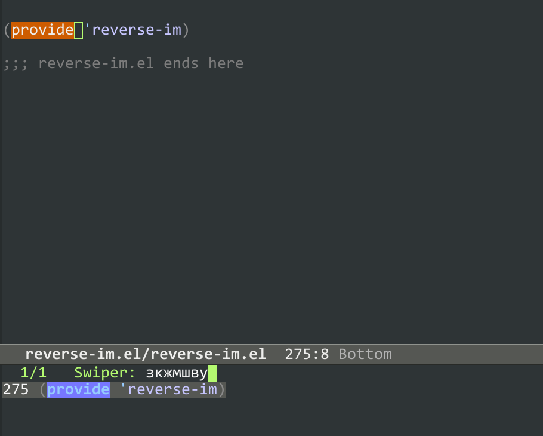
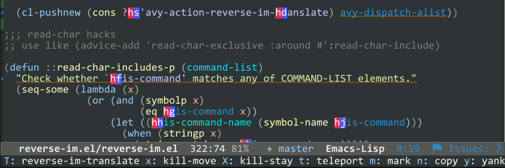

* Reverse-im.el ®

  [[https://melpa.org/#/reverse-im][https://melpa.org/packages/reverse-im-badge.svg]]
  [[https://github.com/a13/reverse-im.el/stargazers][https://img.shields.io/github/stars/a13/reverse-im.el.svg]]
  [[https://github.com/a13/reverse-im.el/issues][https://img.shields.io/github/issues/a13/reverse-im.el.svg]]
  [[https://github.com/vshymanskyy/StandWithUkraine/blob/main/docs/README.md][https://raw.githubusercontent.com/vshymanskyy/StandWithUkraine/main/badges/StandWithUkraine.svg]]

** Rationale
   Are you using a non-Latin keyboard layout? Have you ever seen Emacs display a message such as "C-є is undefined" instead of executing a desired command? If so, then this package is probably for you!

   💡 It's just a collection of hacks, and definitely not a magic bullet, so if you have any issues, please take a look at [[https://github.com/a13/reverse-im.el/issues][known ones]] first.

** Quick start
   💡 I use [[https://www.gnu.org/software/emacs/manual/html_node/use-package/][use-package]] for all the examples here. Since it's a built-in feature of the latest version of Emacs, they should work fine there.
*** Simple setup
    #+BEGIN_SRC emacs-lisp
      (use-package reverse-im
        :ensure t ; install `reverse-im' using package.el
        :demand t ; always load it
        ;; translate these methods, use M-x `list-input-methods'
        ;; if you're not sure which one to use
        (reverse-im-input-methods '("ukrainian-computer"))
        :config
        (reverse-im-mode t)) ; turn the global minor mode on
    #+END_SRC

*** More complex configuration
    💡 See below for details.

    #+BEGIN_SRC emacs-lisp
      ;; Needed for `:after char-fold' to work
      (use-package char-fold
        :custom
        (char-fold-symmetric t)
        (search-default-mode #'char-fold-to-regexp))

      (use-package reverse-im
        :ensure t ; install `reverse-im' using package.el
        :demand t ; always load it
        :after char-fold ; but only after `char-fold' is loaded
        :bind
        ("M-T" . reverse-im-translate-word) ; to fix a word written in the wrong layout
        :custom
        ;; cache generated keymaps
        (reverse-im-cache-file (locate-user-emacs-file "reverse-im-cache.el"))
        ;; use lax matching
        (reverse-im-char-fold t)
        ;; advice read-char to fix commands that use their own shortcut mechanism
        (reverse-im-read-char-advice-function #'reverse-im-read-char-include)
        ;; translate these methods
        (reverse-im-input-methods '("ukrainian-computer"))
        :config
        (reverse-im-mode t)) ; turn the mode on
    #+END_SRC

    These examples should be sufficient in most cases. However, if you need to go deeper:

* Manual Installation and usage

** Manual installation
   This one is for Package.el users. Straight and Elpaca users should already know how to do this.

   #+BEGIN_SRC emacs-lisp
     M-x package-install RET reverse-im RET
   #+END_SRC

** Usage
   Reverse-im provides a simple minor mode that activates/deactivates translations for all
   input methods from ([[https://www.gnu.org/software/emacs/manual/html_node/emacs/Easy-Customization.html][customizable]]) ~reverse-im-input-methods~ list (empty by default).

   If you use [[https://github.com/justbur/emacs-which-key][which-key]] (a built-in feature in the latest Emacs versions), you can examine how an input method will be remapped by calling

   #+BEGIN_SRC emacs-lisp
     M-x reverse-im-which-key-show
   #+END_SRC

*** Manual customization

    💡 I highly recommend the ~use-package~ method.

    #+BEGIN_SRC emacs-lisp
      ;; standard customization interface, note that this will turn on the mode immediately
      M-x customize-variable RET reverse-im-input-methods RET
      ;; These store list variable in `custom-file'.
      ;; provides auto-completion, one input-method at a time
      M-x reverse-im-add-input-method RET ukrainian-computer RET
    #+END_SRC

    Since version 0.0.2 all possible bindings with Ctrl, Meta, and Super are translated.
    If you want to change the behavior, for example, if you don't use Super,
    #+BEGIN_SRC emacs-lisp
      (setq reverse-im-modifiers '(control meta))
      ;; or
      M-x customize-variable RET reverse-im-modifiers RET
    #+END_SRC

*** Activation/Deactivation

    #+BEGIN_SRC emacs-lisp
      M-x reverse-im-mode RET
      ;; or
      (reverse-im-mode t) ; call with a negative argument to disable
    #+END_SRC

    As an alternative, you can call the translation function directly. Since version 0.0.3, it has supported multiple input methods.
    #+BEGIN_SRC emacs-lisp
      (reverse-im-activate '("ukrainian-computer" "arabic"))
    #+END_SRC

    If something goes wrong, or if you simply want to turn the translation off,
    #+BEGIN_SRC emacs-lisp
      M-x reverse-im-deactivate
      ;; or
      (reverse-im-deactivate)
      (reverse-im-deactivate t) ; to reset the translation tables cache
    #+END_SRC

* Extra features
** Advising read-char

   💡 This feature since is experimental, hacky and wasn't tested good enough, so use it on your own risk.

   Reverse-im doesn't work with custom dispatchers like ~org-export~, ~org-capture~ , ~mu4e~ etc.
   Some commands such as ~org-export~, ~org-capture~, and ~mu4e~, use custom dispatchers, don't work out of the box in non-latin layout.
   Fortunately most of them use ~read-char~ or ~read-char-exclusive~ for [[https://www.gnu.org/software/emacs/manual/html_node/elisp/Reading-One-Event.html][reading input]], so we can advice the function to translate input characters. The simplest way is to set ~reverse-im-read-char-advice-function~ defcustom, though you can advice then #manually if you want to.
   There are two possible values - ~reverse-im-read-char-include~ (the less risky one) translates the input iff current command matches (or equals) any element in the customizable ~reverse-im-read-char-include-commands~ list. The more lazy (and risky) version ~reverse-im-read-char-exclude~  translates the input unless the current command matches any element in the ~reverse-im-read-char-exclude-commands~.

   💡 set these before ~reverse-im-mode~ is enabled, or #advice the functions manually

*** Manual configuration
    #+BEGIN_SRC emacs-lisp
      (advice-add #'read-char-exclusive :around #'reverse-im-read-char-include)
      (advice-add #'read-char :around #'reverse-im-read-char-include)
    #+END_SRC
    or
    #+BEGIN_SRC emacs-lisp
      (advice-add 'read-char-exclusive :around #'reverse-im-read-char)
      (advice-add 'read-char :around #'reverse-im-read-char)
    #+END_SRC

** Char folding
   
   Emacs supports [[https://www.gnu.org/software/emacs/manual/html_node/emacs/Lax-Search.html#Lax-Search][Lax Matching During Searching]] and since version 27 you can include your own search substitutions. Reverse-im adds substitutions to ~char-fold-include~ generated using ~reverse-im-char-fold-include~ if ~reverse-im-char-fold~ is set to ~t~ (before ~reverse-im-mode~ is activated).

   #+BEGIN_SRC emacs-lisp
     (use-package char-fold
       :custom
       (char-fold-symmetric t)
       (search-default-mode #'char-fold-to-regexp))
   #+END_SRC

** Interactive translation
   If you want to fix a region or a word which was typed using incorrect layout, you can use interactive functions ~reverse-im-translate-region~ and ~reverse-im-translate-word~ respectively.

** [[https://github.com/abo-abo/avy][Avy]] integration

   

   If avy is installed, reverse-im adds ~avy-action-reverse-im-translate~ to ~avy-dispatch-alist~ (bound to ~reverse-im-avy-action-char~, ~?T~ is default one), so it's possible to translate words and lines which are you jumping to. To disable the functionality ~reverse-im-avy-action-char~ should be set to ~nil~.

* How it works
  Reverse-im overrides [[https://www.gnu.org/software/emacs/manual/html_node/elisp/Translation-Keymaps.html][function-key-map]] for preferred input-method(s) to translate input sequences. The original idea came from [[https://ru-emacs.livejournal.com/82428.html][this blog post]] by [[https://github.com/jurta][Juri Linkov]].

* [[https://github.com/a13/reverse-im.el/issues][Known issues]]:

  - Bindings with AltGr (as Meta) [[https://github.com/a13/reverse-im.el/issues/4#issuecomment-308143947][don't work]] well on Windows.
  - [[https://github.com/a13/reverse-im.el/issues/21][Doesn't]] [[https://github.com/a13/reverse-im.el/issues/6][work]] well for punctuation keys if they are placed on different keys than in English layout.
  - "Buffer is read-only:" error
    Reverse-im doesn't work for ~self-insert-command~ (obviously), but sometimes one may want to use single key shortcuts in read-only modes. In this case it's possible to ~suppress-keymap~ to undefine ~self-insert-command~, so ~function-key-map~ overrides its behavior.
  - Single key shortcuts (i.e. without modifiers) [[https://github.com/a13/reverse-im.el/issues/17][don't work with]] in Hydra
